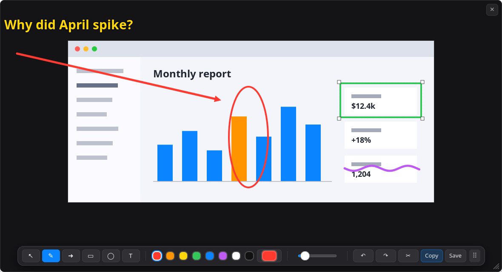
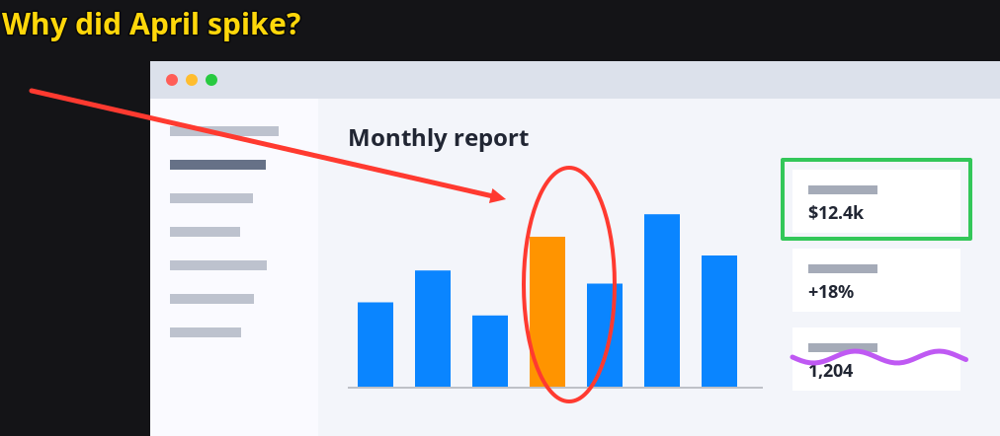

# Screenshooter

Snipping tool for **KDE Plasma on Wayland** that works like **Win+Shift+S** on Windows.

[Русская версия](README.ru.md)



- **Meta+Shift+S**: the screen freezes and you drag a region. The PNG is already in the clipboard.
- A thumbnail pops up in the corner over everything, even fullscreen games. Click it to annotate.
- **Shift+Print**: grab the whole screen, then the same thumbnail and editor.
- **Editor**: pen, arrow, rectangle, ellipse and text, any color and line width.
  Select, move, resize and delete anything you drew, with full undo.
- **Draw outside the image.** The canvas around the screenshot is free space. It only ends up
  in the result if you actually drew there:

  

- **Cut a piece out of a screenshot**: press the region hotkey while the editor is focused.
- **Ctrl+C** copies the result, **Ctrl+S** saves it to `~/Pictures/Screenshots`.
- Hotkeys work in any keyboard layout. The UI is English or Russian, following your locale.

## Install

### Flatpak, any distribution

Flathub listing is on its way. Until then, every [release](https://github.com/JohnSutray/screenshooter/releases)
has a Flatpak bundle:

```bash
flatpak remote-add --user --if-not-exists flathub https://dl.flathub.org/repo/flathub.flatpakrepo
curl -LO https://github.com/JohnSutray/screenshooter/releases/latest/download/screenshooter.flatpak
flatpak install --user screenshooter.flatpak
flatpak run io.github.johnsutray.Screenshooter
```

On the first start your desktop asks you to confirm the shortcuts and to let the app run in
the background, so hotkeys keep working after a reboot.

### Arch Linux, CachyOS, EndeavourOS, Manjaro

A native package is attached to every release:

```bash
sudo pacman -U https://github.com/JohnSutray/screenshooter/releases/download/v0.2.0/screenshooter-0.2.0-1-x86_64.pkg.tar.zst
```

Or build it from the PKGBUILD in this repository:

```bash
git clone https://github.com/JohnSutray/screenshooter
cd screenshooter/packaging/aur
makepkg -si
```

The package is headed for the AUR as `screenshooter` once AUR account registration reopens.

After installing, run `screenshooter` once, or log out and back in. On the first start it
registers its global shortcuts in KDE. The keys are taken over from Spectacle if it holds them.

### From source, for the current user

Needs `python-gobject`, `python-cairo`, `gtk4-layer-shell`, `wl-clipboard`, a C compiler,
`pkg-config` and the GLib headers.

```bash
git clone https://github.com/JohnSutray/screenshooter
cd screenshooter
./install.sh
```

Everything goes to `~/.local`. Remove it with `./install.sh --uninstall`.

## Usage

| Key | In the editor |
|---|---|
| `V` | Select: click a shape, drag it, drag a corner to resize, `Delete` to remove |
| `1` `2` `3` `4` | Pen (default), arrow, rectangle, ellipse |
| `5` | Text: click and type, `Enter` for a new line, `Esc` to finish. Drag a corner to scale it |
| `Ctrl+Z`, `Ctrl+Y` | Undo, redo |
| `Ctrl+C` | Copy the result as PNG |
| `Ctrl+S` | Save to `~/Pictures/Screenshots` |
| region hotkey | Cut a piece out of the current screenshot |
| `Esc` | Deselect, then close |

Color and line width also apply to the selected shape. Drag the window by the ⠿ handle or by
empty space on the toolbar, resize it from the bottom-right corner.

In the region overlay, `Esc` or a right click cancels.

## Configuration

Hotkeys live in `~/.config/screenshooter.conf`, or in
`~/.var/app/io.github.johnsutray.Screenshooter/config/screenshooter.conf` for the Flatpak:

```ini
[hotkeys]
region = Meta+Shift+S
fullscreen = Shift+Print
```

Use KDE key syntax such as `Print`, `Ctrl+Alt+P` or `F15`, or `none` to disable an action.
Apply changes with:

```bash
screenshooter install-hotkey
```

In the Flatpak and outside KDE, the shortcuts belong to your desktop: the config only gives
the suggested keys, and you change them later in the desktop's shortcut settings.

F13 to F24 are handled too. The default keymap sends `XF86Launch5` and similar for them,
and Screenshooter registers whatever your keyboard actually produces.

## How it works

- `src/screenshooter.py`: the whole app in Python, GTK4 and cairo. It runs as a background
  instance, so a hotkey reacts instantly.
- **Capture.** On KDE outside Flatpak, frames come straight from KWin's `org.kde.KWin.ScreenShot2`
  through a tiny C helper, `src/grab.c`, in about 50 ms. KWin leaves the requesting client's own
  windows out of a screenshot, and the separate process lets the editor appear in your next capture.
  Everywhere else the xdg-desktop-portal Screenshot interface is used, in about 0.3 s.
- **Hotkeys.** On KDE outside Flatpak, KDE's `kglobalaccel` over D-Bus, the same way System Settings
  does it. Everywhere else the GlobalShortcuts portal.
- **Overlay and thumbnail** are layer-shell surfaces, which keeps them above every window. Where
  layer-shell is missing, as on GNOME or in X11 sessions, the selection opens as a fullscreen window
  and a notification replaces the thumbnail.
- Everything above is picked at runtime by checking what the session offers, not its version.

## Requirements

Best on KDE Plasma 6 with Wayland. Other desktops need xdg-desktop-portal with the Screenshot
and GlobalShortcuts interfaces, for example GNOME 48 or later and Hyprland.

## Development

```bash
make check            # unit tests, no display needed
tests/run-e2e.sh      # the installed app inside a headless KWin: overlay, thumbnail, clipboard, editor
```

CI runs both on Arch, Fedora and Ubuntu, and builds the Flatpak.

## License

[MIT](LICENSE)
